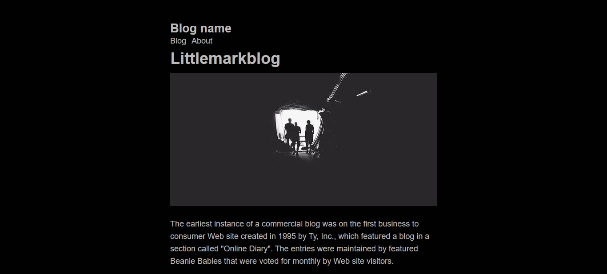

# Littlemark Engine

The most bare-minimal engine to run your blog, without eating your disk space.

- Markdown post supported ✔.
- No docker required.
- No database setup whatsoever.
- No JS framework, which means...
- NodeJS-free 👌.

#### Requirements

Make sure your server have these features:
- **php** to run the engine
- **cron** to schedule an automatic post indexing

#### Installation

- ##### Local setup
    To run the engine, generate a json index list by running the generator first 

    `php machinery.php`

    It will create a posts list `posts.json` that contains a post title and a hash linked to your post.

    After that, you can start run the system locally.
    `php -S localhost:8080 wwwroot/`

    If you add a new post in your blog, don't forget to run the generator after that.

- ##### Online setup

    Upload the `wwwroot` content into your hosting server `wwwroot` and create a cron job to to run `machinary.php` periodically.

#### After That...
1. Make sure to update `About.md` contents inside `wwwroot/lib/`.
2. Replace stock pages in `wwwroot/posts/` with your posts.
3. **Your post filename will be your post title.**
4. Your post date will be based on file date creation
5. **Use Markdown** to write your post. The engine will translate it to HTML automatically thanks to [Parsedown](https://github.com/erusev/parsedown).
6. Avoid writing your draft inside `wwwroot/posts/` directory to prevent your post to be accidentally published to your blog.

#### Donation
If you find this project to be useful, you can give me a cup of tea ;)

 